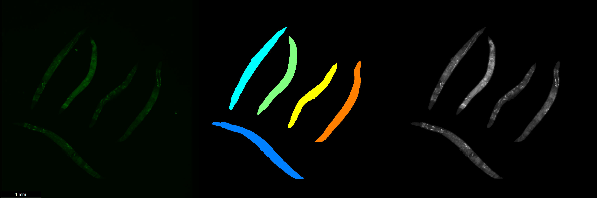
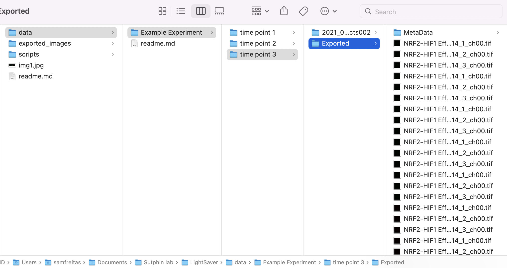

# LightSaver





```
The LightSaver system is data analysis package for fluorecent C. elegans imaging 

Developed by Samuel Freitas with help from Raul Castro-Portugez

The University of Arizona, Sutphin Lab Microbiology (MCB), Biomedical Engineering (BME)
```

# Required matlab packages

  ```
  'Image Processing Toolbox' 
  
  'Computer Vision Toolbox'
  ```


# File parameters setup



>this is how the directories (folders) should be setup to use the multiple_samples -> Lightsaver_batch.m (recommended) script properly. The overarching experiment in this example would be the "Example Experiment" folder under the data folder

*Note: this script recursively scans all possible files for every .tiff file and will sort them by timepoint (specifically the nomenclature DN (Day N)*

*Note: if there is only a single timepoint this directory format must still be followed, just with a single sub experiment folder*

**Important: each image should have a descriptive name of what it is (example: skn-1-HT115-EV_D1_1.tiff,skn-1-HT115-EV_D1_2.tiff). The naming scheme is usually something like exp-name-and-sumbnames_dayN_replicateN.tiff**

**Important: The image names are EXTREMELY important and SHOULD NOT CONTAIN ANY EXTRA INFORMATION besides what is said above (exp-name-and-sumbnames_dayN_replicateN.tiff). If something is repeated across every image it will be removed from the final image names, if RNAi (NGM, NCR, or anything) is repeated across all the image names it WILL be removed, please name experiments accordingly**

**Important: the exporting function only currently accepts different days as timepoints therefor the last piece in the descriptive name**

  - Overarching experiment (example: Oxidative stress )
  
    - Sub experiment 1 (example: timepoint 1 or 1/1/1995)
    
      - some directory with the *.tiff* files (example: exported images from LEICA 
      
    - ...
   
    - Sub Experiment N (example: timepoint n or 1/N/1995) 
      
      - some directory with the *.tiff* files (example: exported images from LEICA)
      

# Usage: Data processing/exporting an entire experiment (recommended)
> Batching an entire experiment at once, and exporting for easy plotting in Prism(TM) 

1.  Set up data as shown in the above example

2.  Open "Lightsaver_batch.m" under the "multiple_samples" directory

3.  Run "Lightsaver_batch.m" by either pressing F5 or the run button at the top of MATLAB

4.  The parameters prompt will open and ask for experiment specific parameters (press ok when completed)

5.  The experiment selection prompt will open, please select the Overarching experiment folder (as specified above)

6.  The script will then display progress bars and where all the data gets exported to

7.  Check the "Exported images" folder to double check output, and rerun with the "Use large blob fix" flag if necessary

# Usage: Data processing single sub-experiments individually (not recommended unless data is extremely noisy and "Bad_images_fix.m" must be used)

1.  open "Ligthsaver_script.m"

2.  set parameters

3.  Run "lightsaver_script.m"

4.  Choose the directory containing the *.tiff* images

5.  Check output data if necessary

  - If there are problems

  - Large blobs?
    - use the large_blob_fix option in lightsaver_script.m

  - Just completely messed up?
    - bad_images_fix.m

6.  There should now be a data.csv file in the directory that contains the *.tifs 

# Usage: data analysis

1.  open and run "Data_analysis_and_export.m"

2.  Choose the overarching experiment folder from the dropdown menu

3.  Check to make sure the "Analyzed_data.csv" is correct and the output_figures directory is present


