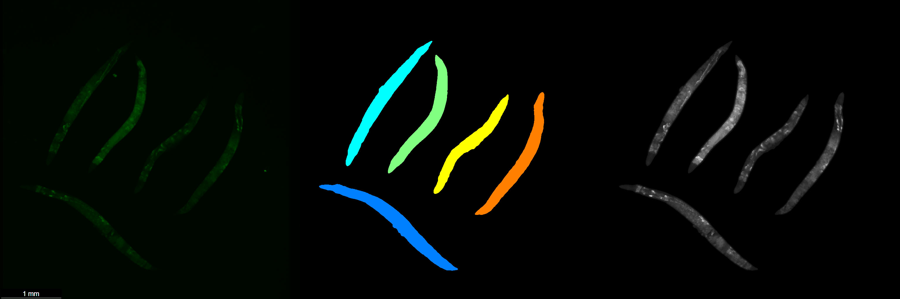
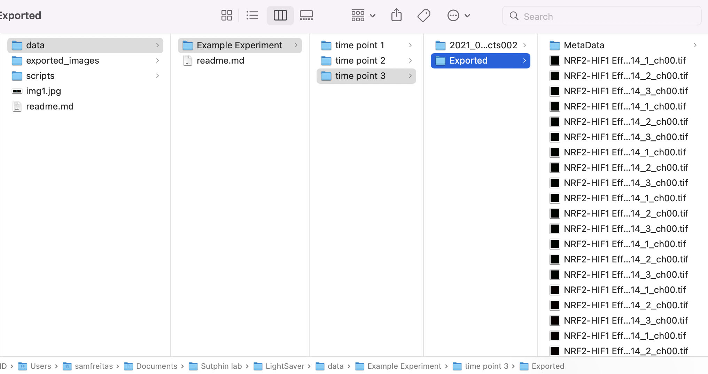

# LightSaver



**LightSaver** is a powerful data analysis package designed for fluorescent *C. elegans* imaging. Developed by Samuel Freitas with contributions from Raul Castro-Portugez, Vanessa Hofschneider, and Lainey Wait at the University of Arizona (Sutphin Lab) in the Microbiology (MCB) and Biomedical Engineering (BME) departments.

> **Note:** LightSaver is available in both **MATLAB** and **Python** — choose whichever you're most comfortable with. Both versions produce near identical results and output the same files.

---

## Step 1: Install GitHub Desktop and Download LightSaver

GitHub Desktop is a free application that lets you download and update LightSaver without using a terminal or command line.

1. Download and install GitHub Desktop: [https://github.com/apps/desktop](https://github.com/apps/desktop)
2. Create a free GitHub account at [https://github.com](https://github.com) — it's recommended **not** to use your `.edu` email for this
3. Open GitHub Desktop, go to **File > Clone Repository** (or press `Ctrl+Shift+O`)
4. Click the **URL** tab at the top of the dialog
5. Paste this URL and click **Clone**:

```
https://github.com/Sam-Freitas/LightSaver
```

LightSaver will be downloaded to your computer, typically into your `Documents/GitHub/LightSaver` folder.

<details>
<summary>Prefer using a terminal instead? Click here.</summary>

Open a terminal (PowerShell, Command Prompt, or macOS Terminal) and run:

```bash
git clone https://github.com/Sam-Freitas/LightSaver
```

</details>

---

## Step 2: Set Up Your Version (MATLAB or Python)

### Option A — MATLAB Setup

**Required MATLAB Toolboxes:**
- Computer Vision Toolbox *(install this first — it will automatically install the Image Processing Toolbox as well)*

To install: go to **Apps** (top bar in MATLAB) → **Get More Apps** → search for **Computer Vision Toolbox** → Install

### Option B — Python Setup

**Required Python Modules:**
`matplotlib`, `natsort`, `numpy`, `opencv_python`, `opencv_python_headless`, `pandas`, `PyQt6`, `PyQt6_sip`, `scipy`, `scikit-image`

**Installation steps:**
1. Open a terminal (PowerShell on Windows, or Terminal on macOS/Linux)
2. Navigate to the `python_scripts` folder inside the LightSaver directory
3. Run the following command, replacing the path with your actual path:

```bash
python -m pip install -r /path/to/python_scripts/requirements.txt
```

> **Tip:** In GitHub Desktop, you can right-click the repository and choose **Open in Terminal** to open a terminal already pointed at the correct folder.

---

## Step 3: Organize Your Data Files

> [!WARNING]
> **Never work directly on your original images.** Always copy your data to a new folder first and run LightSaver on the copy. The script CAN modify image files (naming schemas), and it is good practice to keep your raw data untouched and separate.



LightSaver expects your images to be organized in a specific folder structure. This structure is required even if you only have a single timepoint.

**Required folder layout:**
```
Experiment Folder/           ← This is what you select when running the script
    Day 1/                   ← Timepoint folders, named D1, D2, etc.
        image_D1_1.tiff
        image_D1_2.tiff
    Day 2/
        image_D2_1.tiff
        image_D2_2.tiff
```

The script scans folders recursively and automatically sorts timepoints by day number (D1, D2, D3, etc.).

**Image naming rules:**
- Each image name should describe the experiment, timepoint, and replicate — for example: `skn-1-HT115-EV_D1_1.tiff`
- The general convention is: `experiment-name_DayN_replicateN.tiff`
- The replicate number at the end of each filename is used to group replicates together automatically
- **Make sure all image names are consistent with each other.** The script automatically removes any part of the filename that is identical across *all* images in order to generate clean export labels. Inconsistent naming is the most common cause of unexpected results
- Numbers matching the pattern `001`, `002` ... `009` are automatically stripped from filenames — these are typically added by microscope export software and are not needed

---

## Step 4: Run LightSaver

Both MATLAB and Python versions run identically and produce the same output files.

### Running the MATLAB version

1. Open MATLAB
2. Open `Lightsaver_batch.m` from the `matlab_scripts` folder
3. Press **F5** or click the **Run** button
4. A parameters dialog will appear — fill in your experiment-specific settings and click **OK**
5. A folder browser will open — navigate to and select your overarching **Experiment Folder** (the top-level folder containing all your day subfolders)
6. LightSaver will process all images and show a progress bar
7. When complete, the **Exported images** folder will open automatically (usually located at `Documents/GitHub/LightSaver/Exported images`)

### Running the Python version

1. Open `LightSaver_batch.py` from the `python_scripts` folder in your Python IDE (VS Code is recommended and tested)
2. Press **F5** or click **Run**
3. A parameters dialog will appear — fill in your experiment-specific settings and click **OK**
4. A folder browser will open — navigate to and select your overarching **Experiment Folder**
5. LightSaver will process all images and show a progress bar
6. When complete, the **Exported images** folder will open automatically

---

## Output Files

After processing, LightSaver produces the following files inside your Experiment Folder:

| File | Description |
|------|-------------|
| `data.csv` *(MATLAB)* / `data_python.csv` *(Python)* | Raw per-image measurements: integrated fluorescence intensity and area for each detected worm |
| `Analyzed_data.csv` *(MATLAB)* / `Analyzed_data_python.csv` *(Python)* | Summary statistics across replicates and timepoints |
| `output_figures/` | Automatically generated plots of your experiment data |
| `Exported images/` | Side-by-side processed image previews showing the original, segmentation mask, and masked fluorescence |

> Both the MATLAB and Python versions produce equivalent data — the column names and structure of the CSVs are the same. The only difference is the filename (`data.csv` vs `data_python.csv`).

---

## Troubleshooting

**Worms are being detected as one large blob?**
- Re-run with the **"Use large blob fix"** option enabled in the parameters dialog

**Images are extremely noisy or the results look wrong?**
- MATLAB users: run `Lightsaver_script.m` on individual sub-experiment folders manually, then use `bad_images_fix.m` to correct problem images before re-running the batch script

**Results look unexpected or grouping seems wrong?**
- Check your image filenames first. Make sure they follow the `experiment-name_DayN_replicateN.tiff` convention and are consistent across all images in the experiment

**No images found / script stops immediately?**
- Make sure your images have the `.tif` or `.tiff` extension
- Make sure your images are inside day-numbered subfolders (e.g., `D1/`, `D2/`), not loose in the experiment folder

---

## Running a Single Sub-Experiment (Advanced / Not Recommended)

This approach is only needed if your data is extremely noisy and you need to manually review and fix individual images using `bad_images_fix.m` before proceeding.

1. Open `Lightsaver_script.m` in MATLAB
2. Set your parameters manually in the script
3. Run the script and select the folder containing the `.tiff` images for that sub-experiment
4. A `data.csv` file will be created in that folder
5. If needed, run `bad_images_fix.m` to correct problem images, then repeat

---

## Data Analysis (Runs Automatically with Recommended Settings)

When using the batch script (recommended), data analysis and figure export run automatically at the end of processing.

If you need to re-run analysis separately:

1. Open and run `Data_analysis_and_export.m` in MATLAB
2. Select your overarching Experiment Folder from the dropdown
3. Verify that `Analyzed_data.csv` and the `output_figures/` directory have been created
